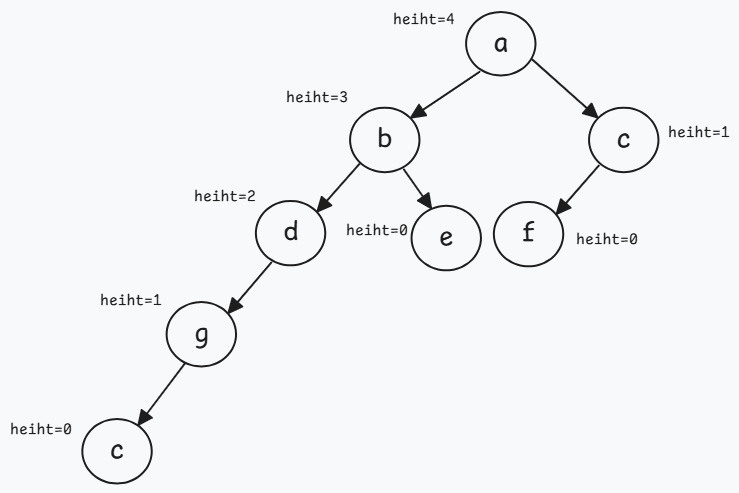
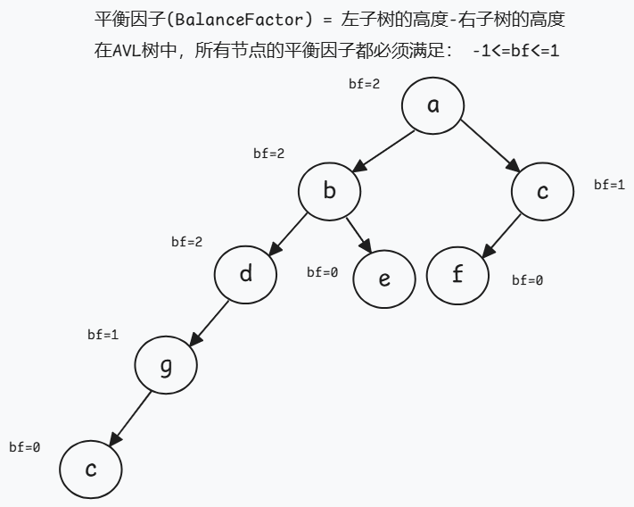
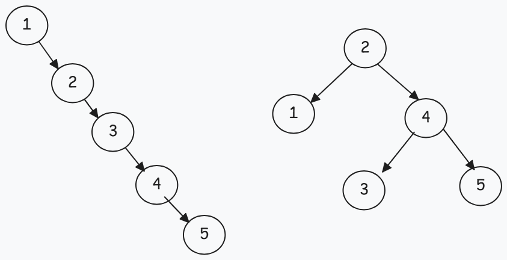
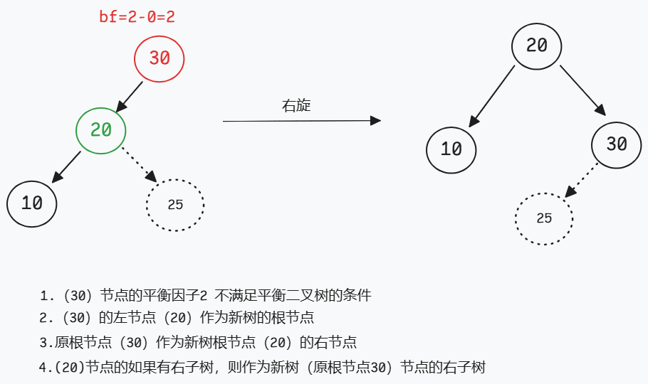
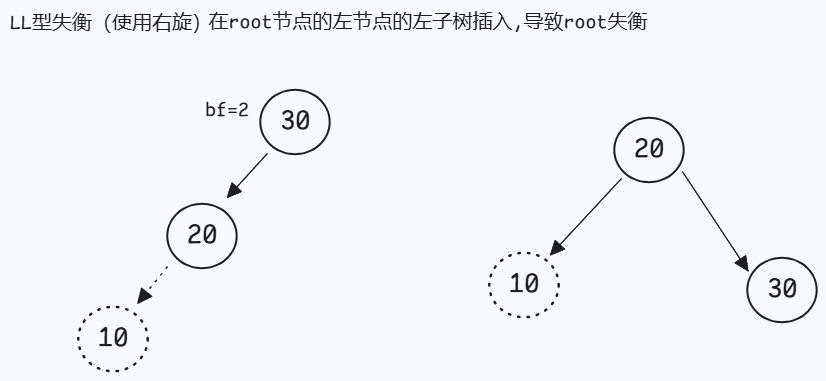
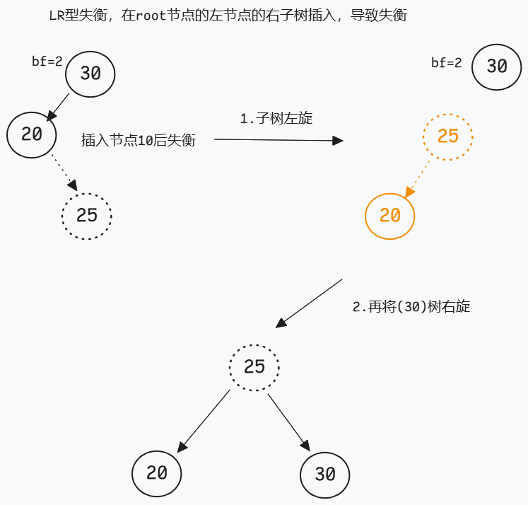
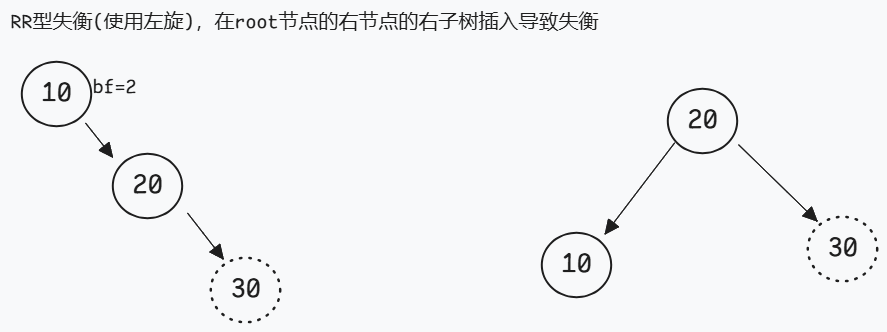

# 1. 定义

## 1.1 特征

AVL树（平衡二叉树），全称**平衡二叉搜索（排序）树**，AVL树本质上是一棵二叉查找树，但它又具有一下特点：

- 它是一棵空树或它的左右两个字数的高度差的绝对值不超过1（任何节点的两个子树的最大差别为1）
- 左右两个子树也都是一棵平衡二叉树

 **平衡因子(Balance Factor,简写bf)**

平衡因子：节点的左子树的深度减去右子树的深度

bf = 左子树高度-右子树的高度

在AVL树中，所有节点的平衡因子都满足 -1<=bf<=1	

**高度**

- **高度 0**：树只有一个节点，即根节点，没有子节点。

- 高度 **-1** 通常表示空树，即根节点也不存在的情况。

对于一般的二叉搜索树（Binary Search Tree）,期望高度为一棵平衡树，但是，在某些极端形况下，二叉树将退化为链，此时其操作的时间复杂度将退化呈线性，即O(n)

### 基础操作

#### 左旋

#### 右旋

### LL型失衡

  在节点的**左**节点的**左**子树插入

### LR型失衡

  在节点的**左**节点的**右**子树插入  

### RR型失衡

  在节点的**右**节点的**右**子树插入

### RL型失衡

  在节点的**右**节点的**左**子树插入  

### 总结

| 类型       | 描述                               | 操作   |
| ---------- | ---------------------------------- | ------ |
| LL(左左型) | 在节点的**左**节点的**左**子树插入 | 右旋   |
| LR(左右型) | 在节点的**左**节点的**右**子树插入 | 左右旋 |
| RR(右右型) | 在节点的**右**节点的**右**子树插入 | 左旋   |
| RL(右左型) | 在节点的**右**节点的**左**子树插入 | 右左旋 |

